<div align="center">

<h3>
<code>kumar-aditya79@github ~ $ ./contributions.sh</code>
</h3>



<br><br>

<h3>
<code>kumar-aditya79@github ~ $ whoami</code>
</h3>

<table>
<tr>
<td valign="top">

</td>
<td valign="top">

</td>
</tr>
</table>

</div><div align="center">

<h3>
<code>kumar-aditya79@github ~ $ ./contributions.sh</code>
</h3>


<br><br>

<h3>
<code>kumar-aditya79@github ~ $ whoami</code>
</h3>

<table>
<tr>
<td valign="top">

</td>

<td valign="top">

</td>
</tr>
</table>

</div>

---

## 👨‍💻 About Me

I'm an aspiring **Data Engineer** interested in building scalable,
data-driven systems and working with Big Data and Cloud technologies.

### 🛠️ Tech Stack

```text
Languages    → Python · SQL · C++
Big Data     → PySpark · Apache Spark
Cloud        → Azure · Databricks
Data         → ETL · Data Pipelines
Databases    → MySQL · MongoDB
Tools        → Git · GitHub · Docker

