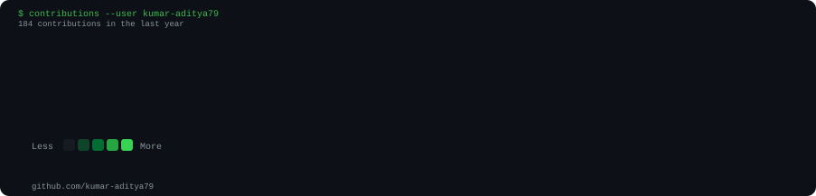

<div align="center">

<!--Who I am starting -->
  
<h3>
<code>Who am I</code>
</h3>

<table>
<tr>
<td valign="top">

</td>

<td valign="top">

</td>
</tr>
</table>

<!--Who I am end -->

<br><br>

<!--contribution starting -->

<h3>
<code>contributions</code>
</h3>



<!--contribution starting -->

</div>

---

## 👨‍💻 About Me

I'm an aspiring **Data Engineer** interested in building scalable, data-driven systems and working with Big Data and Cloud technologies.

I'm also a Computer Science undergraduate (B.Tech, GHRCEM Pune) exploring **Machine Learning, Generative AI and Agentic AI**, and I serve as the **President of the ACM Student Chapter** at my college.

### 🛠️ Tech Stack

```text
Role         → Aspiring Data & AI Engineer
Languages    → Python · SQL · C++ · JavaScript
Big Data     → PySpark · Apache Spark
Cloud        → Azure · Databricks
Data         → ETL · Data Pipelines
Databases    → MySQL · MongoDB · SQLite
ML / AI      → scikit-learn · RAG · LLMs · Agentic AI (learning)
Viz          → Power BI · Tableau · Streamlit · Plotly
Tools        → Git · GitHub · Docker
